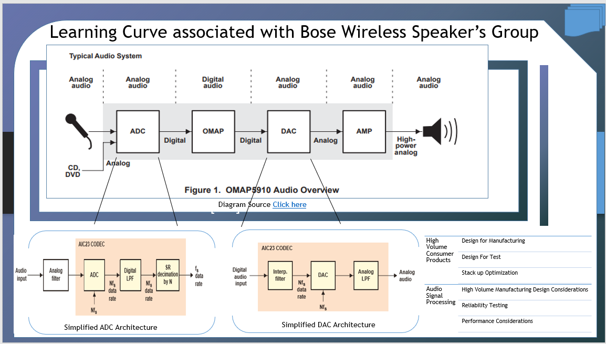

# Mixed Signal System On Chip 

The project focuses on providing an overview of System on Chip designs. For details, please click on the executable located in https://github.com/alpaddesai/SystemOnChip/releases. Company confidential information is not displayed. All images are either custom by Alpa D Desai or a reference name is included. Most of the images are custom. 

## SoC Architecture

## SoC Memory Management

## SoC Customization

## SoC Interconnection

## Mixed-signal circuit design 

Advanced knowledge reference: https://github.com/alpaddesai/PowerElectronics, https://github.com/alpaddesai/ComputerArchitecture,  https://github.com/alpaddesai/AnalogDesign,  https://github.com/alpaddesai/ChipDesign and https://github.com/alpaddesai/SystemLevelDesignProductPortfolioIdea
